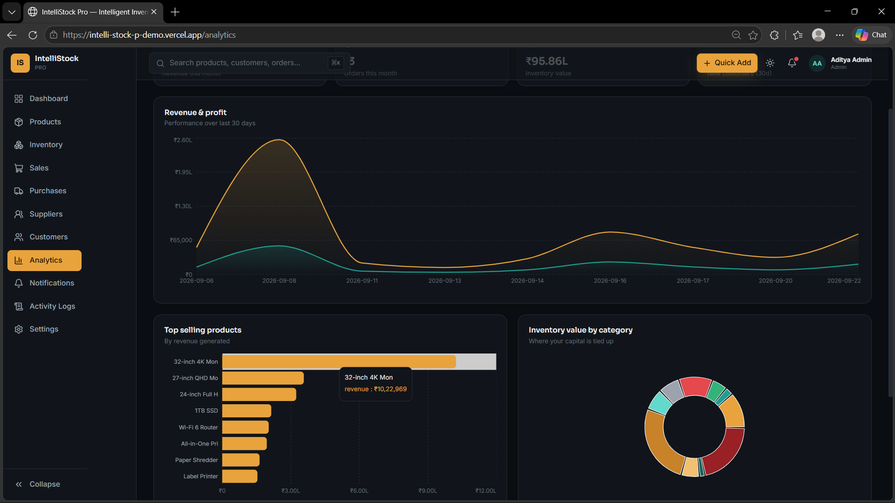
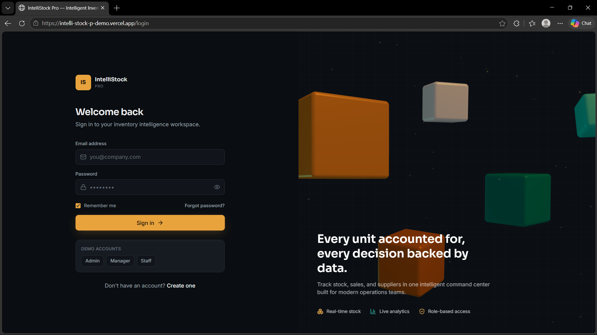
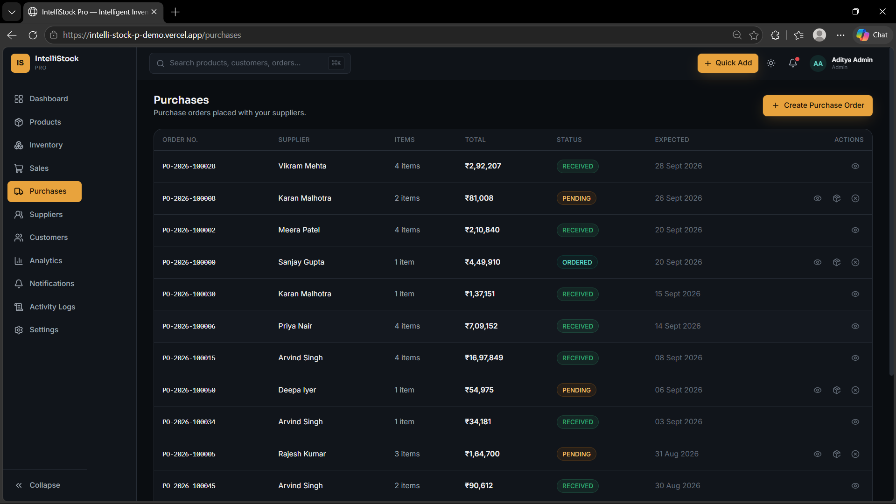

# IntelliStock Pro

**Intelligent inventory. Smarter decisions.**

A production-grade inventory management SaaS: real-time stock tracking, sales & purchase workflows, supplier/customer management, and business analytics — built on a genuine relational database with audited, transaction-safe inventory movements.

## 🚀 Live Demo

👉 [**Open IntelliStock Pro Live Demo**](https://intelli-stock-p-demo.vercel.app)

### 🔐 Demo Login

1. Open the Live Demo.
2. Click **Admin** on the login screen.
3. Demo credentials will be automatically filled.
4. Click **Login** to explore the application.

> **Note:** A dedicated demo account is provided for evaluation purposes.

---

## ✨ Features

- **Dashboard** — live KPIs (inventory value, today's revenue, low/out-of-stock counts, pending orders), sales trend chart, stock health breakdown, low-stock alerts, recent transactions — all computed from the database, nothing hardcoded.
- **Products** — full CRUD, search/filter/sort/pagination, SKU uniqueness, price & stock validation, per-product detail page with stock movement history and profit margin.
- **Inventory** — stock overview + full transaction log. Every stock change (sale, purchase, adjustment, return) is recorded as an `InventoryTransaction` — stock never changes silently.
- **Sales** — cart-style sale creation, automatic stock decrement, tax/discount handling, invoice numbering, all wrapped in a single atomic database transaction.
- **Purchases** — create purchase orders, receive them (stock increases + inventory transaction recorded), or cancel them.
- **Suppliers & Customers** — full CRUD with detail pages showing purchase/sales history and computed totals.
- **Analytics** — revenue/profit charts by range, top-selling & fast/slow-moving products, category value distribution, top customers.
- **Notifications** — auto-generated for low stock, out-of-stock, new/large sales, and purchases received.
- **Activity Logs** — full audit trail of who did what, when.
- **Auth & Roles** — JWT + bcrypt; ADMIN / MANAGER / STAFF roles enforced **server-side** (not just hidden in the UI).
- **Polish** — dark mode, responsive layout, skeleton loaders, empty/error states, confirmation dialogs, toast notifications, a 3D warehouse scene on login, global ⌘K search.

## 🧱 Tech Stack

| Layer      | Technology                                                                 |
|------------|-----------------------------------------------------------------------------|
| Frontend   | React + Vite, Tailwind CSS, Framer Motion, Recharts, Lucide Icons, React Three Fiber / Drei |
| Backend    | Node.js, Express.js (layered: controllers/services/routes/middleware/validators) |
| Database   | **SQLite**, via **Prisma ORM** (relational schema, migrations)              |
| Auth       | JWT + bcrypt, role-based authorization enforced in middleware               |

## 🗂 Architecture

```
intellistock-pro/
├── backend/
│   ├── src/
│   │   ├── controllers/    # request handlers
│   │   ├── routes/         # Express routers
│   │   ├── services/       # business logic (sales, purchases, inventory, analytics)
│   │   ├── middleware/     # auth, role, error handling, validation
│   │   ├── validators/     # request validation
│   │   └── utils/          # helpers (responses, logging, notifications)
│   ├── prisma/
│   │   ├── schema.prisma   # full relational schema
│   │   └── seed.js         # realistic seed data generator
│   └── .env.example
└── frontend/
    └── src/
        ├── api/            # centralized API client, one module per resource
        ├── components/     # ui/ (primitives), layout/, dashboard/, products/, sales/, purchases/
        ├── context/         # Auth, Theme, Toast
        ├── pages/          # one file per route
        └── utils/          # formatting helpers
```

## 🚀 Getting Started

### Prerequisites
- Node.js 18+
- npm

### 1. Install dependencies
```bash
cd backend && npm install
cd ../frontend && npm install
```

### 2. Set up environment variables
```bash
# backend/.env (already created from .env.example)
DATABASE_URL="file:./dev.db"
JWT_SECRET="change-this-secret"
JWT_EXPIRES_IN="7d"
PORT=5000

# frontend/.env
VITE_API_URL=http://localhost:5000/api
```

### 3. Set up the SQLite database with Prisma
```bash
cd backend
npx prisma migrate dev --name init
npm run seed
```
> **Note:** Prisma's CLI downloads a small query-engine binary the first time you run a migration command. This requires normal internet access (it was the one thing this build sandbox couldn't reach). On your own machine this is automatic and only happens once.

### 4. Run the app
```bash
# Terminal 1
cd backend && npm run dev
# → http://localhost:5000

# Terminal 2
cd frontend && npm run dev
# → http://localhost:5173
```

### 5. Log in with a demo account

| Role    | Email                     | Password     |
|---------|---------------------------|--------------|
| Admin   | admin@intellistock.com    | Admin@123    |
| Manager | manager@intellistock.com  | Manager@123  |
| Staff   | staff@intellistock.com    | Staff@123    |

The seed script also creates 10 categories, 10 suppliers, 35 customers, 55 products, ~55 purchase orders, ~130 sales, and their full inventory transaction history — so the dashboard and analytics show real, non-trivial data from the moment you log in.

## 🔌 API Overview

All routes are prefixed with `/api` and (except auth) require `Authorization: Bearer <token>`.

```
POST   /api/auth/register            POST   /api/auth/login          GET  /api/auth/me
GET    /api/products                 POST   /api/products            GET  /api/products/:id
PUT    /api/products/:id             DELETE /api/products/:id
GET    /api/inventory                GET    /api/inventory/transactions
POST   /api/inventory/adjust
GET    /api/sales                    POST   /api/sales                GET  /api/sales/:id
GET    /api/purchases                POST   /api/purchases            GET  /api/purchases/:id
POST   /api/purchases/:id/receive    POST   /api/purchases/:id/cancel
GET    /api/suppliers                POST   /api/suppliers            GET  /api/suppliers/:id
GET    /api/customers                POST   /api/customers            GET  /api/customers/:id
GET    /api/analytics/dashboard      GET    /api/analytics/sales
GET    /api/analytics/inventory      GET    /api/analytics/business
GET    /api/notifications            PUT    /api/notifications/:id/read
GET    /api/activity-logs            GET    /api/search?q=
GET    /api/settings                 PUT    /api/settings
```

Every response follows `{ success, message, data?, meta? }`; errors follow `{ success: false, message, errors? }`.

## 🔐 Security Notes

- Passwords are hashed with bcrypt (never stored in plaintext).
- JWT secret and DB path are environment variables (`.env`, never committed — see `.gitignore`).
- Role checks happen in Express middleware, not just the React UI.
- Prisma parameterizes all queries (no raw SQL injection surface).
- Sales/purchases run inside `prisma.$transaction()` — a failure midway rolls back everything, so stock can never desync from its transaction history.

## 🛣 Future Improvements

- Barcode scanning via device camera for point-of-sale
- Multi-warehouse / multi-location stock transfers
- Email notifications and scheduled low-stock digests
- CSV/Excel import-export for bulk product management
- Refund and partial-return workflows for sales

## 📸 Screenshots

## 📸 Screenshots

### Dashboard


### Product Management


### Purchases


### Analytics


---
Built as a demonstration full-stack SaaS project — **v1.0.0**.
